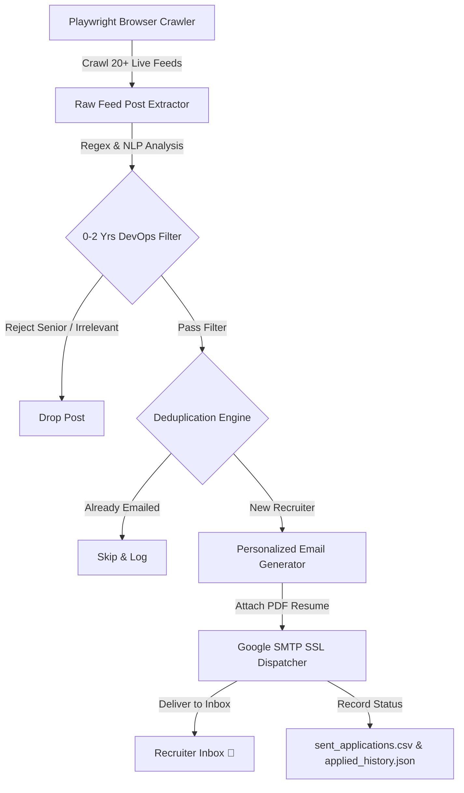

<div align="center">

# 🤖 JobHunter — Autonomous Cloud & DevOps Job Discovery & Cold Outreach Engine

[](https://www.python.org/)
[](https://playwright.dev/)
[](LICENSE)
[](https://github.com/itskie/jobhunter)

*An enterprise-grade, zero-touch automated job hunting pipeline that continuously monitors live tech communities, filters 0–2 years Cloud/DevOps opportunities, dynamically parses recruiter contacts, and dispatches tailored cold outreach emails with attached PDF resumes.*

---

</div>

## 🌟 Key Features

- **🌐 Multi-Feed Playwright Crawler:** Scrapes real-time hiring posts across 20+ search streams & top tech groups (LinkedIn, Pan-India & Remote).
- **🔍 Smart Heuristic & NLP Filter:** Strictly targets **0–2 Years (Fresher / Junior / Intern)** Cloud & DevOps roles while rejecting senior requirements (3+/5+/10+ yrs).
- **🛡️ Anti-Spam & Deduplication Engine:** Persistent cache indexing ensures no recruiter ever receives duplicate applications.
- **📝 Automated Hyper-Personalization:** Dynamically composes customized email bodies highlighting candidate projects (e.g., [InfraGenie](https://github.com/itskie/infragenie)), certifications, and tech stacks.
- **📧 Direct Google SMTP Delivery:** Connects via authenticated SSL (`smtp.gmail.com:465`) with automatic binary PDF resume attachment.
- **📊 Real-time Audit Trail:** Comprehensive CSV logging with timestamps, recipient details, subject lines, and delivery statuses.

---

## 🏗️ Architecture



---

## 📁 Repository Structure

```text
├── config.py             # Central candidate settings & search configurations
├── auto_pilot.py         # Master crawler & autonomous pipeline runner
├── job_extractor.py      # Regex & heuristic parser for skills, exp & emails
├── email_generator.py    # Dynamic cover letter & cold outreach generator
├── auto_mailer.py        # Authenticated SMTP dispatcher with attachment engine
├── run.sh                # 1-Command executable shell launcher
├── .env.example          # Environment variables template
└── requirements.txt      # Python dependencies
```

---

## 🚀 Quickstart

### 1. Clone & Install Dependencies

```bash
git clone https://github.com/itskie/jobhunter.git
cd jobhunter

# Create and activate virtual environment
python3 -m venv venv
source venv/bin/activate

# Install requirements & browser binaries
pip install -r requirements.txt
playwright install chromium
```

### 2. Configure Environment

```bash
cp .env.example .env
```

Add your 16-character **Gmail App Password** to `.env`:
```env
GMAIL_APP_PASSWORD=xxxx xxxx xxxx xxxx
```

### 3. Set Candidate Details in `config.py`

Update `config.py` with your name, contact info, and the path to your PDF resume.

### 4. Run JobHunter

```bash
./run.sh
```

---

## 📄 License

This project is licensed under the MIT License - see the [LICENSE](LICENSE) file for details.

---

<div align="center">
  <b>Built with ❤️ by <a href="https://github.com/itskie">Shobhit Kumar Singh</a></b>
</div>
