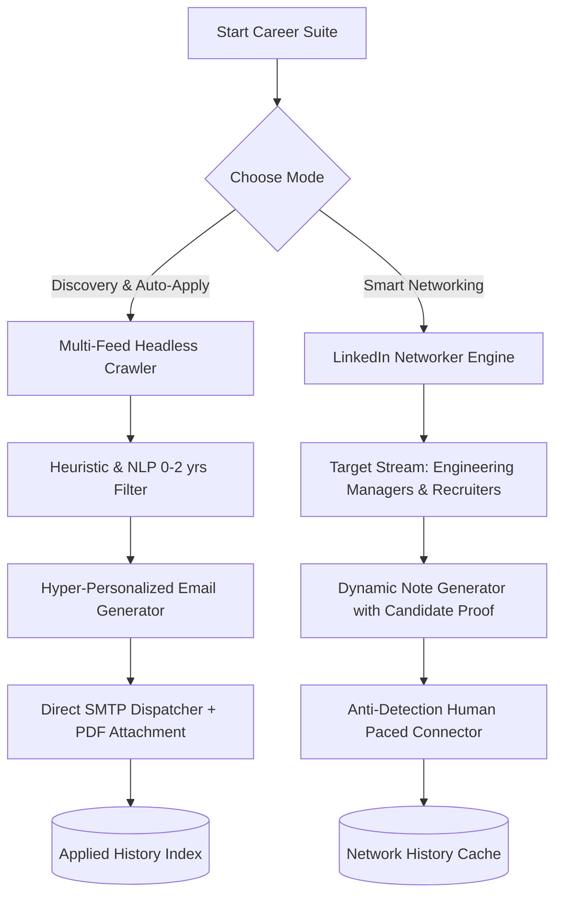

<div align="center">

# 🤖 JobHunter & Career Suite

### Autonomous Job Discovery, Tailored Cold Outreach & Smart LinkedIn Networking Engine

[](https://www.python.org/)
[](https://playwright.dev/)
[](https://opensource.org/licenses/MIT)

**JobHunter** is an end-to-end autonomous career automation platform built for engineers. It crawls real-time hiring feeds across tech communities, filters opportunities with precision heuristics, generates hyper-personalized cover outreach with PDF resume attachments, and autonomously builds high-value connections with Engineering Managers & Tech Recruiters.

</div>

---

## 🌟 Key Architecture & Capabilities



### 1. 🔍 Autonomous Job Discovery & Outreach
- **Multi-Feed Crawler:** Scrapes real-time hiring streams across LinkedIn, developer communities, and recruiter posts.
- **NLP & Heuristic Filter:** Strictly targets **0–2 Years (Fresher / Junior / Intern / Trainee)** Cloud & DevOps roles, instantly filtering out senior noise.
- **Anti-Spam Deduplication:** Persistent cache tracking prevents ever sending duplicate emails to the same recruiter.
- **Direct SMTP Delivery:** Dispatches authenticated Google SMTP applications with your latest PDF resume automatically attached.

### 2. 🤝 Autonomous LinkedIn Smart Networker
- **Target Stream Discovery:** Searches for active *Engineering Managers (Cloud/DevOps)*, *Technical Recruiters*, and *DevOps Leads*.
- **Dynamic Note Generation:** Crafts high-conversion personalized connection notes under 300 characters highlighting relevant builder proof (like InfraGenie).
- **Anti-Detection Pacing:** Incorporates random human delays (5–12s) and strict daily quotas to keep accounts 100% safe.
- **Network History:** Tracks all sent connection requests to avoid redundancy.

---

## 🚀 Quickstart Guide

### 1. Clone & Configure
```bash
git clone https://github.com/itskie/jobhunter.git
cd jobhunter
cp .env.example .env
```

Edit `.env` with your candidate information and Google App Password:
```env
CANDIDATE_NAME="Your Name"
CANDIDATE_EMAIL="your_email@gmail.com"
CANDIDATE_PHONE="+91 9876543210"
CANDIDATE_GITHUB="https://github.com/yourusername"
CANDIDATE_LINKEDIN="https://linkedin.com/in/yourprofile"
GMAIL_APP_PASSWORD="xxxx xxxx xxxx xxxx"
```

### 2. Run Modes

#### 🔹 Mode 1: Job Discovery & Cold Outreach (Default)
```bash
./run.sh
```

#### 🔹 Mode 2: Autonomous LinkedIn Networker
```bash
./run.sh network
```

#### 🔹 Mode 3: Full Pipeline (Jobs + Networking)
```bash
./run.sh all
```

---

## 🛡️ Privacy & Safety
- **Zero Hardcoded Secrets:** All private credentials and session cookies are excluded via `.gitignore`.
- **Anti-Spam Engine:** Indexed JSON databases ensure zero duplicate applications or unwanted repeated messages.

---

## 📄 License
This project is open-source under the [MIT License](LICENSE).
